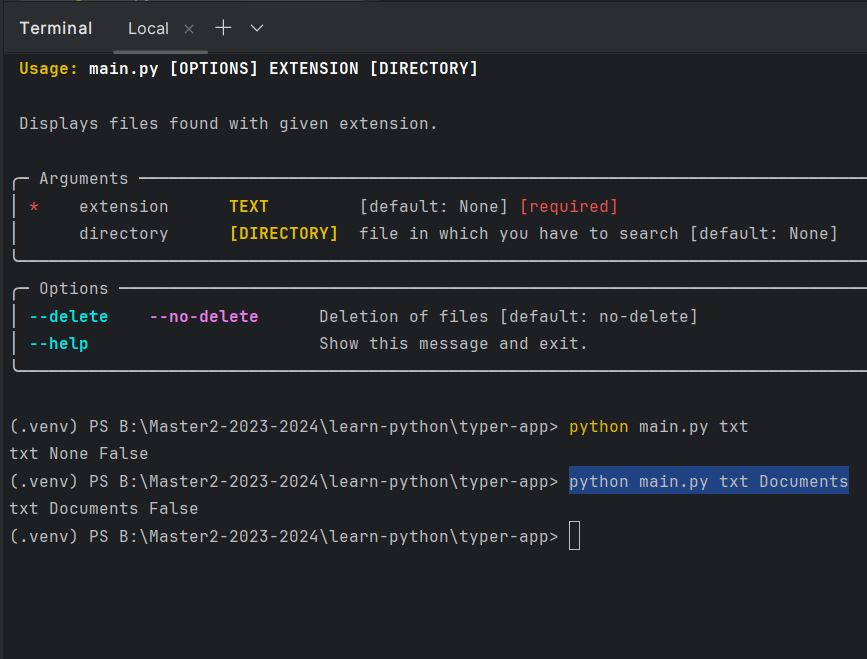
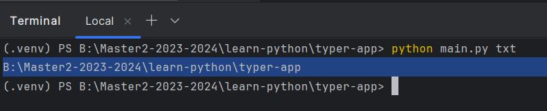
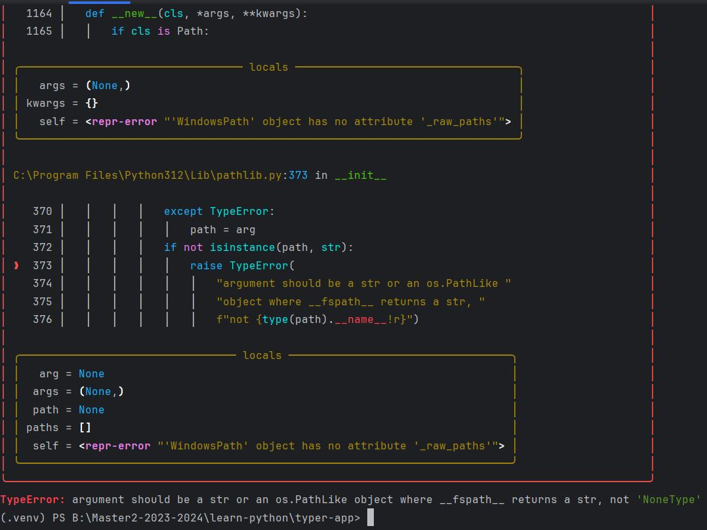

#Leanr to BUILD a Command Line App with Typer 

Note: Files in this  project are enough documented.
Every file almost represent a small project.
So you can pick one by one and try to understand the source code.

How to USE Typer as a db.

How to CREATE your own commands.
 
How to COLORATE Or put STYLE your SYNTAXE.

## Documentation

[Documentation](https://pypi.org/project/typer/)

## 🚀 About Author
Bonevy BEBY is a Software Engineer,an Accross Plateforms Archictecturer and a Trainer. He's also passionnate with DevOPs and Cloud Services.

## 🛠 Skills
Javascript, HTML, CSS,java,Javascript,Typescript,Python,PHP,DOT.NET...

@Accross plateforms trainer
My contacts: 00221 77 862 72 72 | bonevybeby@gmail.com